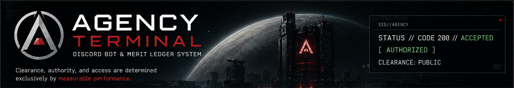
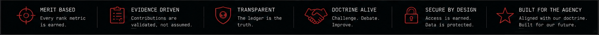
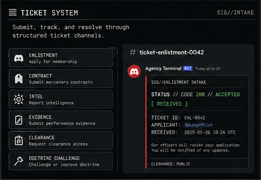
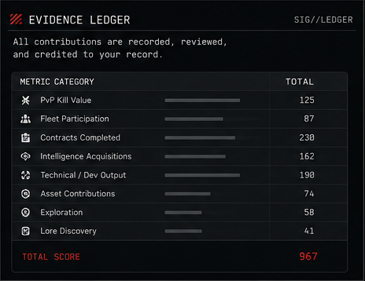
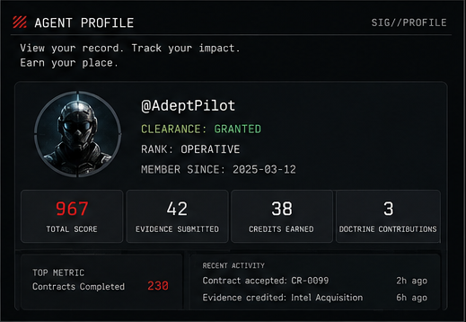
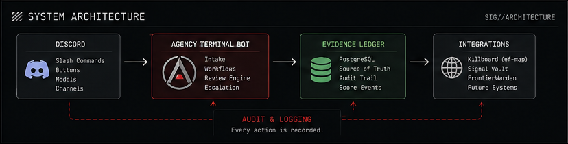
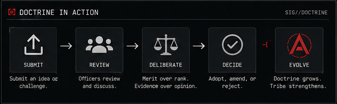
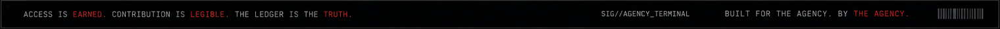

# Agency Terminal Concept Suite

**Agency Terminal** is a Discord-native operations and evidence ledger system for **The Agency // Lux Letifera**, an EVE Frontier mercenary tribe.

North star:

> Agency Terminal should not decide who is valuable. It should make contribution legible.

This suite contains the concept docs, architecture, MVP roadmap, Discord UX, Evidence Ledger model, hosting plan, ADRs, website wrapper copy, visual asset briefs, and a drop-in terminal-style webpage component.

## Doctrine Alignment

## Ticket System

## Evidence Ledger

## Agent Profile

## System Architecture

## Doctrine in Action

---

## Suite contents

### Core docs
- `docs/01_PRD.md` — Product requirements document
- `docs/02_ARCHITECTURE.md` — System, module, and reliability architecture
- `docs/03_HOSTING_ARCHITECTURE.md` — Railway/Supabase/Vercel hosting + soft launch
- `docs/04_EVIDENCE_LEDGER.md` — Append-only ledger, group credit, appeals, corrections
- `docs/05_WORKFLOW_STATE_MACHINES.md` — Workflow-specific state machines (enlistment, contract, intel, evidence, clearance, doctrine)
- `docs/06_GROUP_CREDIT_AND_WITNESSES.md` — Multi-agent credit and witness model
- `docs/07_APPEALS_AND_CORRECTIONS.md` — Evidence appeals and score correction path
- `docs/08_CONTROLS_PAGE.md` — Internal operator console spec
- `docs/09_SECURITY_PRIVACY_COUNTERINTEL.md` — Auth, permissions, counterintelligence, retention
- `docs/10_OPERATING_DOCTRINE.md` — Social contract and red-team checklist
- `docs/11_IMPLEMENTATION_ROADMAP.md` — Build phases and acceptance gates
- `docs/12_OPERATOR_RUNBOOK.md` — Launch, daily ops, and incident response
- `docs/adrs/*` — Architecture decision records

### Web components
- `web/AgencyTerminalPage.tsx` — React/Tailwind concept page
- `web/static-agency-terminal.html` — Standalone HTML mockup
- `web/controls-page-wireframe.md` — Controls page wireframe

### Assets
- `assets/*.svg` — Simple concept SVGs for hero/section mocks
- `assets/readme/*` — README concept board images

### Database
- `packages/db/migrations/001`-`007` — Complete SQL schema

---

## Recommended first build

1. Evidence Ledger schema
2. Ticket intake and Discord modals
3. Quorum review system
4. Timeout escalation
5. Score event creation
6. Public/officer `/profile` views
7. Enlistment, Contract, Intel, Evidence, Doctrine Challenge workflows
8. Integrations later

---

